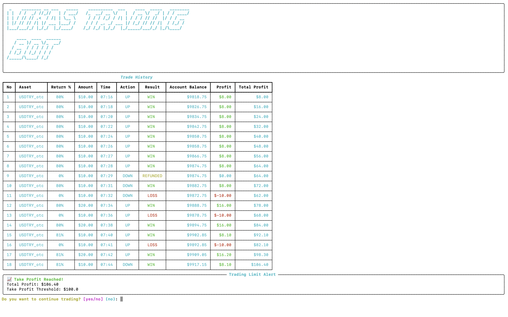

# 🚀 Vikas Auto Trading Bot for Quotex

Welcome to the **Vikas Auto Trading Bot** showcase! This is a fully automated trading bot designed for **Quotex**, utilizing advanced strategies such as **price action and candlestick patterns** to maximize trading efficiency.

> 📌 **Note:** This is a **showcase repository**. The full source code is **private**.

---

## 📷 Trading Bot UI Screenshots

Here are some preview images of the bot's user interface:

  
*Main dashboard showing real-time trading performance.*

  
*Settings panel where users configure stop-loss, take-profit, and trade parameters.*

---

## 🔥 Features of Vikas Auto Trading Bot

✅ **Automated Trading** – Trades on **Quotex** using advanced strategies.  
✅ **Stop-Loss & Take-Profit** – Prevents excessive losses and locks in profits.  
✅ **Trade Expiry Selection** – Supports multiple trade timeframes (1 min, 2 min, etc.).  
✅ **Real-Time Monitoring** – Tracks market trends and executes orders instantly.  
✅ **Secure Authentication** – User login system to protect account access.  
✅ **Professional UI** – A sleek, dark-themed interface for a smooth trading experience.  

---

## 🎯 How It Works

1. **Login** – Securely enter your Quotex credentials.  
2. **Select Account Type** – Choose between demo or real trading mode.  
3. **Set Parameters** – Configure stop-loss, take-profit, and trade expiry time.  
4. **Start Trading** – The bot will analyze the market and execute trades automatically.  

---

## 📌 Why Is This Repo Public Without Code?

This GitHub repository is public **for portfolio purposes**. The actual bot's source code is **private**, but you can contact me for inquiries.

---

## 📬 Contact Me

📧 **Email**: [your-email@example.com](mailto:your-email@example.com)  
💬 **Telegram**: [@vikas655](https://t.me/vikas655)  

---

## 📢 Disclaimer

⚠️ **Trading involves financial risk.** This bot is provided for **educational purposes only**. I am not responsible for any financial losses incurred while using automated trading systems.  

---

### 🌟 Like This Project?  
⭐ **Star this repo** if you find it interesting! Follow me for more projects.  

---

## 🔗 Related Projects
- [My Private Trading Bot Repo (Hidden)](https://github.com/vikaskumar890/VikasAutoTradingBot) *(Not accessible to the public)*
